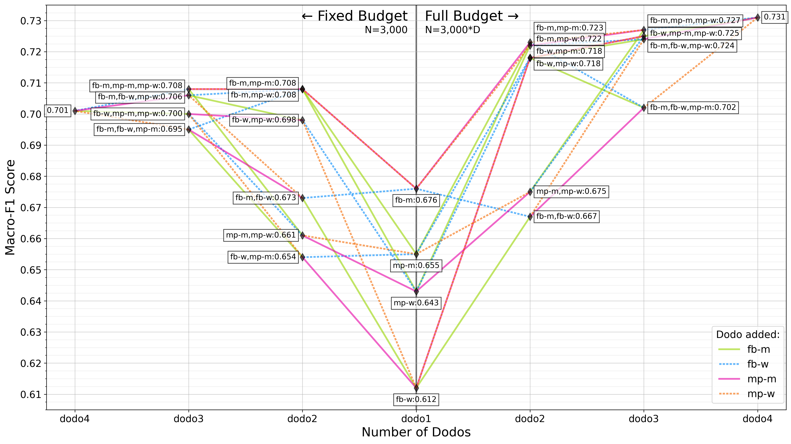

# 🦤 DoDo Learning

Repository for *"DoDo Learning: Domain-Demographic Transfer for Detecting Abuse Against Public Figures"* by [Hannah Rose Kirk](https://github.com/HannahKirk),
[Angus R. Williams](https://github.com/angusrw),
Liam Burke,
Yi-Ling Chung,
Ivan Debono,
Pica Johansson,
Francesca Stevens,
Jonathan Bright,
and Scott A. Hale.

*Performance of models trained on `dodo` combinations on the total test set.*

## Abstract

> Public figures receive a disproportionate amount of abuse on social media, impacting their active participation in public life. Automated systems can identify abuse at scale but labelling training data is expensive, complex and potentially harmful. So, it is desirable that systems are efficient and generalisable, handling both shared and specific aspects of online abuse. We explore the dynamics of cross-group text classification in order to understand how well classifiers trained on one domain or demographic can transfer to others, with a view to building more generalisable abuse classifiers. We fine-tune language models to classify tweets targeted at public figures across domains (sport and politics) and demographics (women and men) using our our novel DoDo dataset, containing 28,000 labelled entries, split equally across four domain-demographic pairs. We find that (i) small amounts of diverse data are hugely beneficial to generalisation and model adaptation; (ii) cross-demographic transfer is easier but produces less generalisable models than cross-domain transfer, (iii) some groups contribute more to generalisation than others, and (iv) dataset similarity is a signal of transferability. We envisage new avenues of research that can contribute to better understanding of discourse between social media users and public figures.

## Repo

This repository contains python scripts for setting up and running experiments, available in `src/dodo`. Due to the dataset for the paper not being released, we omit scripts relating to data processing/loading.

There are 3 subfolders within `src/dodo`:
1. `utils/` contains `helper_functions.py`, a set of shared functions used across experiments.
   
2. `model_training/` contains scripts for setting up and running baseline model experiments that fine-tune a pre-trained language model on combinations of datasets:
   - `baselines_experiment_setup.py` creates a csv of batches of baseline experiments and the parameters for experiments. There is an option to create experiments with fixed (all experiments have 3000 training entries) or raw data size (original sizes are concatenated).
   - `launch_baseline_experiments.py` launches a batch of baseline experiments using the experiment setup csvs and the train_transformer script.
   - `train_transformer.py` launches a single model training run for a given experiment setup, model and seed. It saves the model files to blob storage and outputs predictions over the full test set.

3. `model_adaptation/` contains scripts for setting up and running model adaptation experiments that fine-tuned existing baseline models on new datasets:
   - `adaptations_experiment_setup.py` creates a csv of batches of model adaptation experiments and the parameters for experiments.
   - `launch_adaptations_experiments.py` launches a batch of adaptation experiments using the experiment setup csvs and the adapt_transformer script.
   - `adapt_transformer.py` launches a single model adaptation run for a given experiment setup, model and seed. It saves the model files to blob storage and outputs predictions over the full test set.

A compatible conda environment can be created using `environment.yml`.

A csv containing labelled keywords used for boosted data sampling are availale in `data/shared/final_keywords.csv`.

See `data_statement.md` for a full data statement on the DoDo dataset.

## License

We make the source code for this project available under the MIT License.
